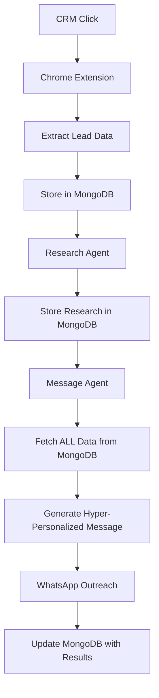

# Analysis 01: System Architecture & Data Flow

This document provides a comprehensive analysis of the AI Sales Agent system, focusing on its architecture, stated goals, key configurations, and the intended data flow. The analysis is based on the project's primary documentation and configuration files.

## 1. Project Purpose and Goals

The central vision of this project is to create a sophisticated, AI-powered sales automation system that showcases **MongoDB as the core intelligence hub**. The system is designed to provide tangible business value by automating and hyper-personalizing sales outreach.

### Key Objectives:

*   **Showcase MongoDB:** The primary goal is to demonstrate MongoDB's capabilities in an AI-centric environment, specifically as a "single source of truth" that enables intelligent agent coordination, flexible data management, and real-time context sharing.
*   **Hyper-Personalization:** To move beyond generic templates and generate highly contextual, personalized messages by leveraging deep CRM data and real-time research. The target is a personalization score greater than 0.8.
*   **Sales Automation:** To significantly reduce the manual effort involved in sales outreach, aiming for a 90% reduction in manual work and an end-to-end processing time of less than 60 seconds per lead.
*   **Improve Response Rates:** To achieve a 2-3x improvement in lead response rates compared to traditional, non-personalized outreach.
*   **Production-Ready System:** To build a robust, scalable, and real-world application, not just a proof-of-concept. This includes using real APIs (Monday.com, Tavily, Gemini), a scalable backend (FastAPI), and reliable messaging (WhatsApp).

## 2. Overall System Architecture

The system is architected as a multi-component solution that integrates a web browser extension, a backend API with AI agents, and external services, with MongoDB acting as the central data and state management layer.

### Core Components:

1.  **Chrome Extension (`extension/`):**
    *   Acts as the user-facing entry point, integrated directly into the Monday.com CRM interface.
    *   Its primary responsibility is to identify a lead, extract a minimal identifier (`monday_item_id`), and trigger the backend workflow.
    *   It provides real-time feedback to the user on the processing status.

2.  **FastAPI Backend (`backend/`):**
    *   A scalable Python backend that orchestrates the entire workflow.
    *   It houses the AI agents, communicates with external APIs (Monday.com, Tavily, Gemini), and manages the data flow into and out of MongoDB.

3.  **AI Agents (`backend/agents/`):**
    *   A team of specialized agents, each with a distinct role:
        *   **Workflow Coordinator:** The central orchestrator that manages the sequence of operations.
        *   **Research Agent:** Gathers external intelligence on a lead's company using the Tavily API.
        *   **Message Agent:** Generates the hyper-personalized outreach message using Google's Gemini model, drawing context from all data stored in MongoDB.
        *   **Outreach Agent:** Sends the final message through the WhatsApp bridge and tracks its status.

4.  **WhatsApp Bridge (`whatsapp/`):**
    *   A Node.js application using `whatsapp-web.js` to provide a reliable, non-official API for sending WhatsApp messages. It decouples the main application from the complexities of WhatsApp integration.

5.  **MongoDB Atlas (The Intelligence Hub):**
    *   The cornerstone of the architecture. It is not just a database but the **single source of truth** for all data, state, and configuration.
    *   It stores CRM data, research findings, generated messages, agent configurations, and workflow status, allowing for seamless data sharing and state management between agents.

### Architectural Diagram (as per `README.md`):

## 3. Key Configurations & Behavior Definition

The system's behavior is not hardcoded; it is dynamically defined by a series of configuration files and a centralized configuration document in MongoDB. This makes the system exceptionally agile and customizable.

*   **`backend/config/business_config.py`:** Defines the seller's identity, including the business owner's details, company information, service offerings, and specific value propositions. This context is injected into the AI agents to ensure the outreach is aligned with the business's brand and goals.

*   **`backend/config/revolutionary_prompts.py`:** This is the core of the AI's "personality." It contains highly engineered, constraint-based prompts that guide the message generation process. It uses techniques like few-shot learning (providing good and bad examples), psychological triggers, and strict output formatting to force the LLM to produce high-quality, personalized message text rather than meta-commentary. It also includes industry- and role-specific overlays to further tailor the messaging.

*   **`backend/config/seed_agent_configurations.py`:** This script centralizes all agent configurations (prompts, API settings, quality thresholds, retry logic) into a single document in a MongoDB collection named `agent_configurations`. This is a critical architectural decision that allows for:
    *   **Dynamic Configuration:** Agent behavior can be tuned in real-time by modifying the document in MongoDB, without requiring a code deployment.
    *   **A/B Testing:** Different prompt strategies or configurations can be tested easily.
    *   **Centralized Control:** Provides a single place to manage the behavior of the entire AI agent system.

*   **`backend/config/monday_board_config.py`:** Maps the application's internal data model to the specific structure of the Monday.com "Leads" board, ensuring the system can correctly interpret the CRM data.

## 4. Intended Data Flow

The data flow is explicitly designed to reinforce MongoDB's role as the single source of truth. Each step in the workflow enriches a central document in the `contacts` collection.

1.  **Initiation:** The user clicks the "Process Lead" button in Monday.com. The Chrome extension extracts the `monday_item_id`.

2.  **CRM Data Ingestion:** The backend receives the ID, calls the Monday.com API to fetch *all* available data for that lead (notes, updates, columns), and stores this comprehensive data in a new MongoDB document in the `contacts` collection, identified by the `monday_item_id`.

3.  **Research Enrichment:** The Research Agent is triggered. It uses the company name from the MongoDB document to perform research via Tavily. The findings (company intelligence, conversation hooks, confidence score) are **updated back into the same MongoDB document**.

4.  **Message Generation:** The Message Agent is triggered. It **retrieves the complete, enriched document** from MongoDB, which now contains both CRM and research data. It uses this full context to generate a hyper-personalized message. The generated message, along with quality scores, is **updated back into the MongoDB document**.

5.  **Outreach & Final Update:** The Outreach Agent takes the generated message from the MongoDB document and sends it via the WhatsApp bridge. The delivery status and message ID are then **updated one last time into the MongoDB document**, marking the workflow as complete.

This atomic, document-centric approach ensures that at any point in the workflow, any agent can access the complete and up-to-date context for a given lead simply by querying a single document in MongoDB.